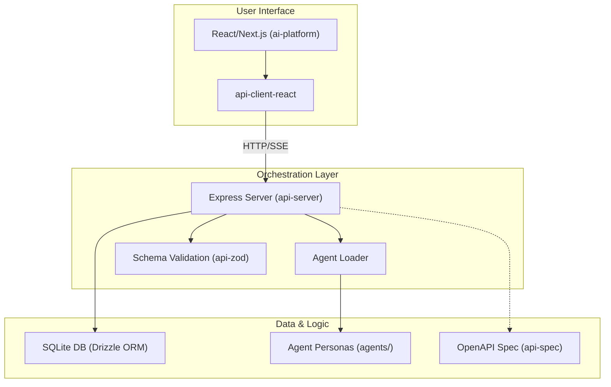

# 🏗️ Project Architecture

This document provides a comprehensive overview of the **Multi-Agent Orchestration Platform** architecture, component relationships, and data flow.

## 🌟 High-Level Architecture

The platform is designed as a modular monorepo, following an **API-First Development** methodology. It separates the core orchestration logic, the interactive user interface, and the domain-specific agent personas.

---

## 📁 Repository Structure

### 🚀 Applications (`/artifacts`)
- **`ai-platform/`**: A modern React-based dashboard for managing projects, agents, and task streams. Uses **Framer Motion** for animations and **Lucide** for iconography.
- **`api-server/`**: The core orchestrator. Manages task execution, agent loading, and persistence. Supports real-time streaming using **Server-Sent Events (SSE)**.
- **`mockup-sandbox/`**: A specialized environment for rapid UI testing and mockup development.

### 📚 Core Libraries (`/lib`)
- **`api-spec/`**: The "Source of Truth" for the entire platform. Contains the **OpenAPI 3.0** specification.
- **`api-zod/`**: Auto-generated Zod schemas from the OpenAPI spec, ensuring end-to-end type safety.
- **`api-client-react/`**: Auto-generated React Query hooks for seamless integration with the backend.
- **`db/`**: Centralized database layer using **Drizzle ORM** for type-safe SQLite interactions.

### 🤖 Agent Ecosystem (`/agents`)
Contains domain-specific agent definitions categorized by expertise:
- **Engineering & Product**: Software architects, developers, and product managers.
- **Marketing & Sales**: Growth hackers, lead generators, and copywriters.
- **Specialized**: Spatial computing experts, game developers, and academic researchers.

---

## 🔄 Core Data Flow

1.  **Specification**: Any change to the API starts in `lib/api-spec`.
2.  **Generation**: Scripts sync changes across `api-zod` and `api-client-react`.
3.  **Consumption**: 
    - The **Frontend** uses generated hooks to interact with the API.
    - The **Backend** uses Zod schemas to validate requests and Drizzle to persist task states.
4.  **Execution**: The **Agent Loader** dynamically sources personas from the `agents/` directory to provide domain-specific intelligence.

---

## 🛠️ Technology Stack

| Layer | Technologies |
| :--- | :--- |
| **Frontend** | React, Next.js, Tailwind CSS, Framer Motion, TanStack Query |
| **Backend** | Node.js, Express, TypeScript, Zod, Pino Logging |
| **Database** | SQLite, Drizzle ORM |
| **Protocols** | REST, Server-Sent Events (SSE) |
| **Tooling** | pnpm workspaces |
